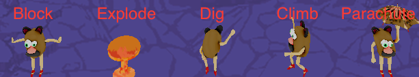
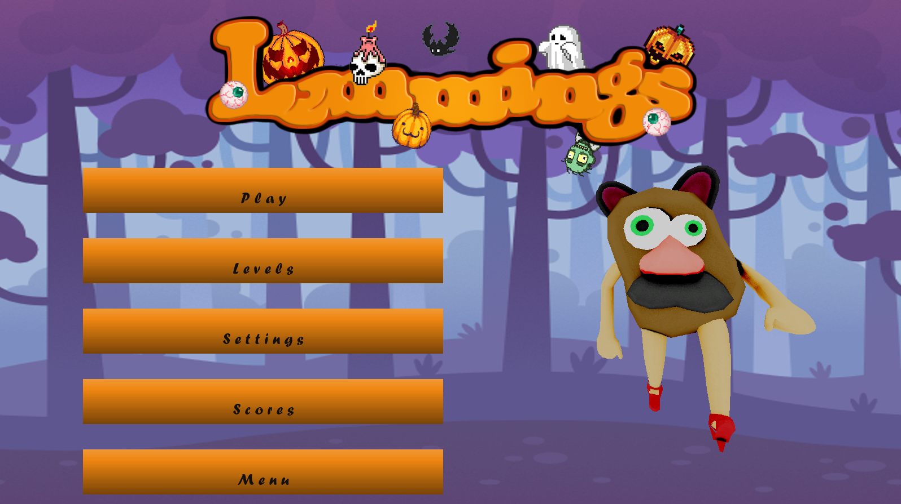
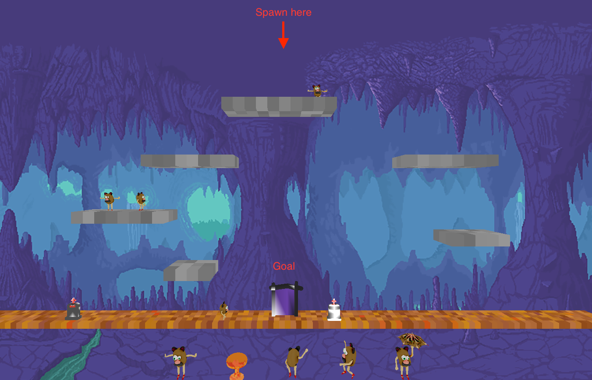
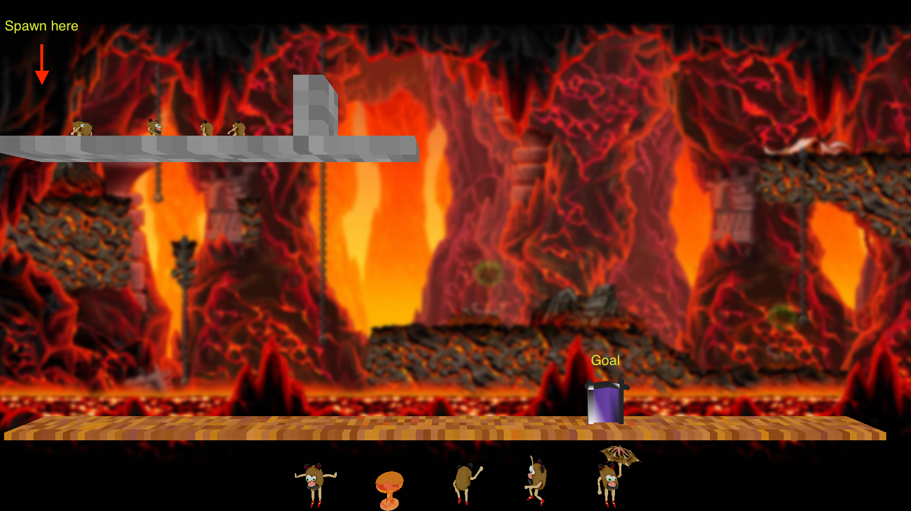
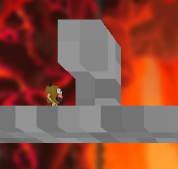
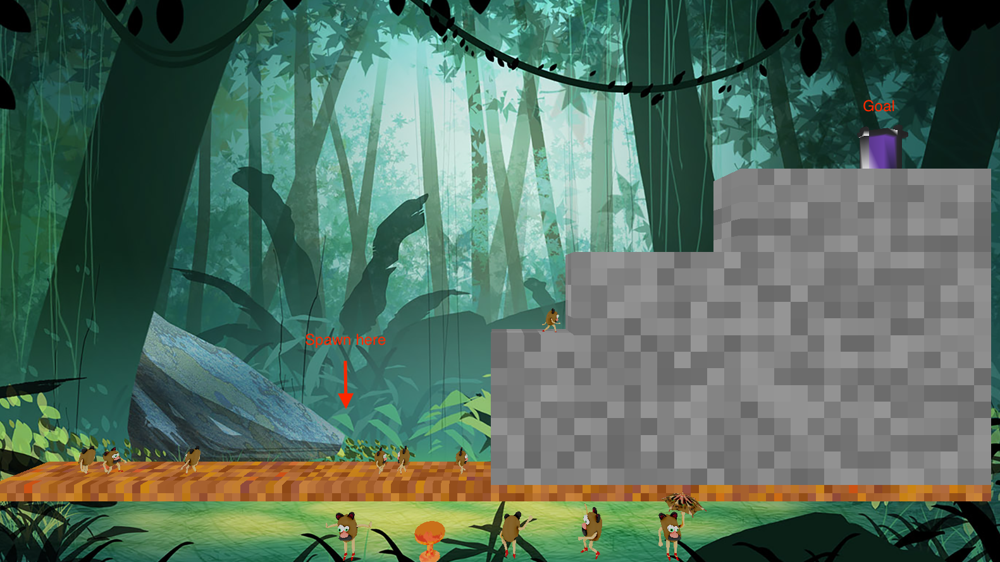
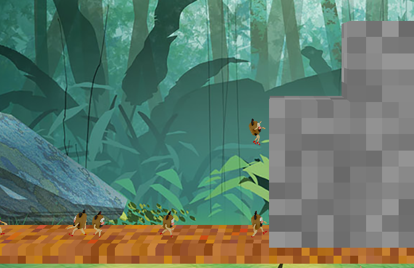

# LemmingsStudio
Recode of the game Lemmings

## Presentation of the game
The goal is to get as much lemmings (the potato heads) as you can through the gate. 
\
These characters will spawn and walk only one way. 
So you have to direct them thanks to the commands so that they don't fall or just get stuck between walls.
\
To do so: select an action and attribute it to a character.

5 actions are available to command the lemmings.

- The block makes the potato head act as a wall. Every mate that encounters him changes direction.
- This action makes the potato head nuke himself. Use with moderation.
- The dig action gives the potato head the power of a dwarf ! Good if you have a wall that bothers you.
- Climbing enables him to access higher structures !
- The parachute prevent the potato head to fall and be smooched on the ground.

We implemented 3 levels.

But first the home screen !

### Level 1

*Your goal in this level is to place the potato head at the good place so they do not fall 
(like it happen where there is a grave)*

### Level 2

*Here your plan will be to either climb or dig this stupid wall. Then be careful, the platform is very high ! you don't want to clean up the mashed potato...*
\

### Level 3

*"Cause baby there ain't nooo mountain hiiiiigh enough !!!" I think you get my point here...*
\

### Conclusion
A few specs of the game :
- Beautiful graphics
- Epic halloween theme.
- Levels for casual and hardcore players
- Destructible map
- Gravity

## Installation
**You need Irrlicht 3d library installed on your machine.**

- Cross platform (Linux, macOs, Windows).
- Player has to guide a group of Lemmings through obstacle to the exit gate.
- 5 actions can be set to a lemming : guard, dig, parachute, climb and kamikaze.
- Map and lemmings are destrutible.
- Hundreds of Lemmings can appear and have different actions - Memory and game loop optimization needed.

On UNIX system
`./unix-build.sh`
On Windows
`.\win-build.ps1`

Launch `indie_studio` program in build folder.

Note:

This project was built with the participation of my friends [Roman Blondeau](https://github.com/RomanBlondeau), [Théo Penavaire](https://github.com/theo-pnv), and [Paul Dach](https://github.com/PaulDach).
\
I did some improvements personally since the [Lemmings](https://github.com/VictorDebray/LemmingsStudio/commit/3ea2be30bf1998f825cde673c819c2638574eef8) commit.
